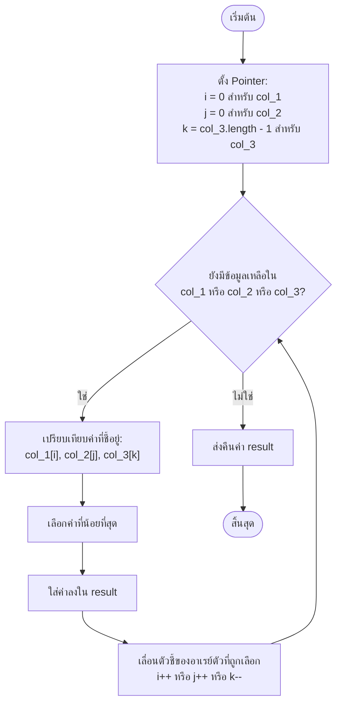

# Merge Arrays Test (TypeScript)

โปรเจกต์นี้จัดทำขึ้นเพื่อพัฒนาฟังก์ชันในการผสานและจัดเรียงอาร์เรย์ (Merge sorted arrays) จำนวน 3 ชุดตามข้อกำหนด โดยเขียนขึ้นด้วยภาษา TypeScript พร้อมกับการทำ Unit Test และทำตามหลักปฏิบัติที่ดีที่สุด (Best Practice)

## โจทย์ (Problem Description)
เขียนโปรเจกต์ TypeScript พร้อมการเขียน Unit Test สำหรับพัฒนาฟังก์ชันที่ทำหน้าที่รวม (Merge) อาร์เรย์จำนวน 3 ชุดเข้าด้วยกัน และส่งกลับเป็นอาร์เรย์ใหม่ที่ถูกจัดเรียงลำดับจากน้อยไปมาก (Ascending Order)

### Interface ของฟังก์ชัน
```typescript
merge(collection_1: number[], collection_2: number[], collection_3: number[]): number[]
```

## ข้อกำหนดและเงื่อนไข (Constraints & Preconditions)
- **ข้อมูลนำเข้า (Inputs):**
  - `collection_1` และ `collection_2` ถูกเรียงลำดับจากค่าน้อยที่สุด (min) ไปหาค่ามากที่สุด (max) เรียบร้อยแล้ว
  - `collection_3` ถูกเรียงลำดับจากค่ามากที่สุด (max) ไปหาค่าน้อยที่สุด (min) เรียบร้อยแล้ว
- **ข้อห้ามสำคัญ (Note):** **ไม่อนุญาตให้ใช้ฟังก์ชันจัดเรียงตัวเลข (Sort function) สำเร็จรูปใด ๆ** ทั้งสิ้น (เช่น `.sort()` ของ JavaScript/TypeScript)

---

## ขั้นตอนการทำงานของอัลกอริทึม (Algorithm Flow)

เนื่องจากข้อห้ามใช้ฟังก์ชัน `sort` สำเร็จรูป เราจึงใช้แนวคิด **3-Way Pointer Merge** ในการสแกนข้อมูลจากทั้ง 3 อาเรย์พร้อมกันในรอบเดียว ซึ่งทำงานดังนี้:



### รายละเอียดขั้นตอนการทำงาน (Step-by-Step Flow)

1. **การกำหนดตัวชี้เริ่มต้น (Initialization):**
   - ตัวชี้ `i = 0` สำหรับ `collection_1` (สแกนจาก 0 ไปยังตัวสุดท้าย เพราะเรียงจากน้อยไปมากอยู่แล้ว)
   - ตัวชี้ `j = 0` สำหรับ `collection_2` (สแกนจาก 0 ไปยังตัวสุดท้าย เพราะเรียงจากน้อยไปมากอยู่แล้ว)
   - ตัวชี้ `k = collection_3.length - 1` สำหรับ `collection_3` (สแกนจากตำแหน่งสุดท้ายย้อนกลับมาตำแหน่งแรกสุด เพื่อกลับลำดับจากมากไปน้อยให้เป็น **น้อยไปมาก** อัตโนมัติ)

2. **หลักการทำงานของตัวชี้ในการเปรียบเทียบค่า (Pointer Logic & Comparison):**
   ในแต่ละรอบของการทำงาน ระบบจะตรวจสอบและตัดสินใจเลือกค่าที่น้อยที่สุดผ่านตัวชี้:
   - **ตรวจสอบการมีอยู่ของข้อมูล (`has1`, `has2`, `has3`):** ป้องกันข้อผิดพลาดของข้อมูลว่างเปล่า (out of bounds)
   - **เงื่อนไขเปรียบเทียบหาค่าน้อยที่สุด:**
     * **เลือกอาเรย์ที่ 1 (`collection_1[i]`):** เมื่ออาเรย์ที่ 1 ยังมีข้อมูล **และ** (อาเรย์ที่ 2 หมดแล้ว หรือค่าน้อยกว่า/เท่ากับตัวชี้ `j`) **และ** (อาเรย์ที่ 3 หมดแล้ว หรือค่าน้อยกว่า/เท่ากับตัวชี้ `k`)
     * **เลือกอาเรย์ที่ 2 (`collection_2[j]`):** เมื่ออาเรย์ที่ 2 ยังมีข้อมูล **และ** (อาเรย์ที่ 1 หมดแล้ว หรือค่าน้อยกว่า/เท่ากับตัวชี้ `i`) **และ** (อาเรย์ที่ 3 หมดแล้ว หรือค่าน้อยกว่า/เท่ากับตัวชี้ `k`)
     * **เลือกอาเรย์ที่ 3 (`collection_3[k]`):** หากเงื่อนไขข้างต้นไม่ตรง จะเลือกอาเรย์ที่ 3 โดยปริยาย
   - **การเลื่อนตำแหน่งตัวชี้:** เมื่อเลือกข้อมูลตัวใดมาใส่ในผลลัพธ์แล้ว จะเลื่อนตำแหน่งตัวชี้ของอาเรย์นั้นทันที (`i++`, `j++` หรือ `k--`) เพื่อนำข้อมูลตัวถัดไปมาเปรียบเทียบในรอบหน้า

3. **ประสิทธิภาพของอัลกอริทึม (Complexity):**
   - **Time Complexity:** $O(n_1 + n_2 + n_3)$ เนื่องจากเป็นการไล่ตรวจสอบผ่านข้อมูลทุกตัวเพียงรอบเดียว (Single Pass)
   - **Space Complexity:** $O(1)$ auxiliary space (ไม่รวมอาเรย์ผลลัพธ์ใหม่)

---

## โครงสร้างโปรเจกต์ (Project Structure)

- **[src/merge.ts](file:///D:/merge-arrays-test/src/merge.ts)**: โค้ดหลักที่ใช้ในการทำงานของฟังก์ชัน `merge`
- **[test/merge.test.ts](file:///D:/merge-arrays-test/test/merge.test.ts)**: ชุดคำสั่งทดสอบ Unit Test ครอบคลุมเคสต่างๆ (เช่น ค่าซ้ำ, ค่าติดลบ, หรืออาเรย์ว่าง)
- **[package.json](file:///D:/merge-arrays-test/package.json)**: ข้อมูลโปรเจกต์ สคริปต์ และ Dependencies
- **[tsconfig.json](file:///D:/merge-arrays-test/tsconfig.json)**: การตั้งค่าคอมไพเลอร์ TypeScript
- **[jest.config.js](file:///D:/merge-arrays-test/jest.config.js)**: การตั้งค่าสำหรับระบบรันคำสั่งทดสอบ Jest

---

## ขั้นตอนการติดตั้งและใช้งาน (Installation & Setup)

### สิ่งที่จำเป็นต้องมี (Prerequisites)
- [Node.js](https://nodejs.org/) เวอร์ชัน 18 ขึ้นไป

### 1. ติดตั้ง Dependencies
เปิด Terminal ในโฟลเดอร์โปรเจกต์แล้วรันคำสั่ง:
```bash
npm install
```

### 2. การรัน Unit Tests
ทำการทดสอบการทำงานของฟังก์ชันด้วย Jest:
```bash
npm test
```

### 3. คอมไพล์โปรเจกต์ (Build)
คอมไพล์ TypeScript ให้ออกมาเป็นโค้ด JavaScript ที่โฟลเดอร์ `dist/`:
```bash
npm run build
```